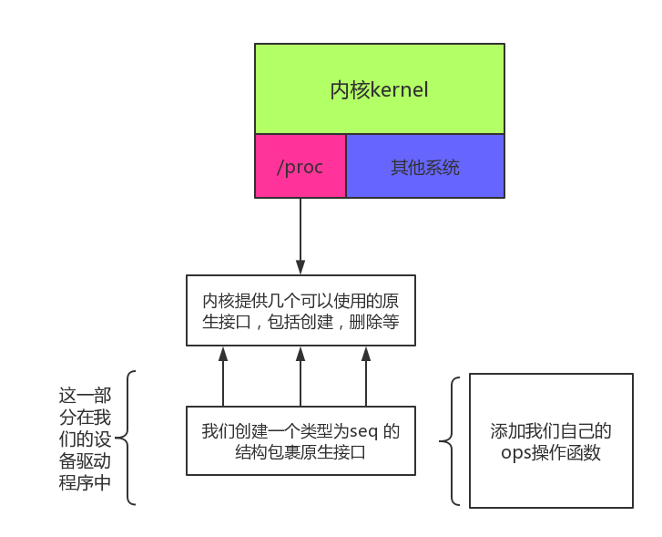
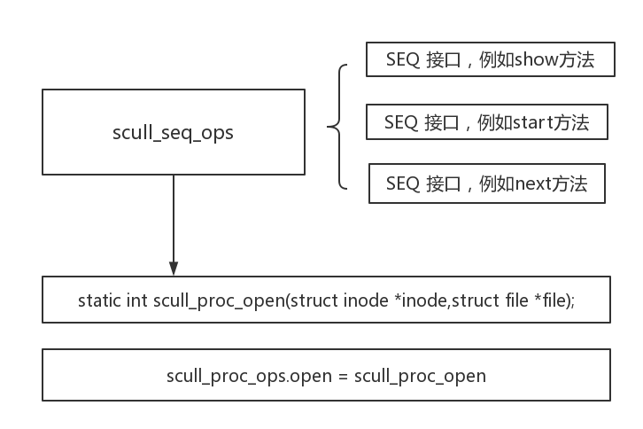
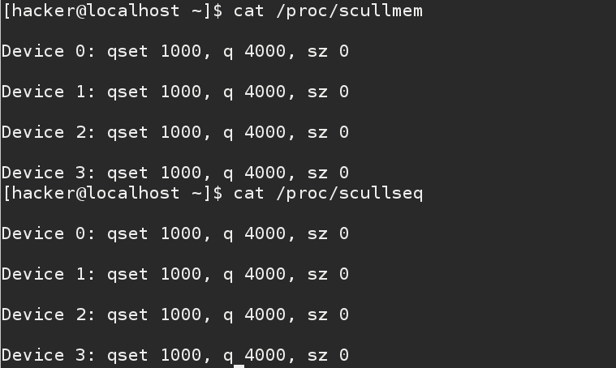

## 内核调试的几种方法

#### 内核自带的调试开关

CONFIG_DEBUG_KERNEL:      打开基本内核调试功能。

CONFIG_DEBUG_SLAB  :      内核进行自动检测内存空间泄露，方法极其暴力。

CONFIG_DEBUG_SPINLOCK：   内核将捕获对未初始化的自选锁的操作。

CONFIG_DEBUG_INFO ：      构造包含GDB 调试信息的完整数据。

CONFIG_DEBUG_STACKUSAGE： 检查内核栈是否溢出。

CONFIG_KALLSYMS：         将在内核中包含符号信息，用于调试上下文。

CONFIG_DEBUG_DRIVER:      打开驱动程序核心中的调试问题。

CONFIG_INPUT_EVBUG:       打开输入事件的详细记录。

#### printk 的八个级别输出

KERN_EMERG：用于紧急事件消息

KERN_ALERT：用于立即需要采取动作的情况

KERN_CRIT： 临界状态，严重操作失败

KERN_ERR：  报告错误状态

KERN_WARNING： 对可能出现的情况进行警告

KERN_NOTICE：有必要进行提示的正常情形

KERN_INFO：   提示性信息

KERN_DEBUG：  用于调试信息

## 创建/PROC 下文件 使用调试

#### /proc 系统
1. /proc目录
Linux 内核提供了一种通过 /proc 文件系统，在运行时访问内核内部数据结构、改变内核设置的机制。proc文件系统是一个伪文件系统，它只存在内存当中，而不占用外存空间。它以文件系统的方式为访问系统内核数据的操作提供接口。
用户和应用程序可以通过proc得到系统的信息，并可以改变内核的某些参数。由于系统的信息，如进程，是动态改变的，所以用户或应用程序读取proc文件时，proc文件系统是动态从系统内核读出所需信息并提交的。下面列出的这些文件或子文件夹，并不是都是在你的系统中存在，这取决于你的内核配置和装载的模块。另外，在/proc下还有三个很重要的目录：net，scsi和sys。 Sys目录是可写的，可以通过它来访问或修改内核的参数，而net和scsi则依赖于内核配置。例如，如果系统不支持scsi，则scsi 目录不存在。
除了以上介绍的这些，还有的是一些以数字命名的目录，它们是进程目录。系统中当前运行的每一个进程都有对应的一个目录在/proc下，以进程的 PID号为目录名，它们是读取进程信息的接口。而self目录则是读取进程本身的信息接口，是一个link。

#### 创建一个/proc 下的一个文件

首先，流程图。

结果创建成功

大致流程   ，编写seq的接口，绑定到文件，将seq接口注册到proc_open函数中，每次创建一个proc文件后将seq 接口绑定到scull_proc_ops ,每次创建一个proc 文件后，可以通过此结构调用到seq的方法。
